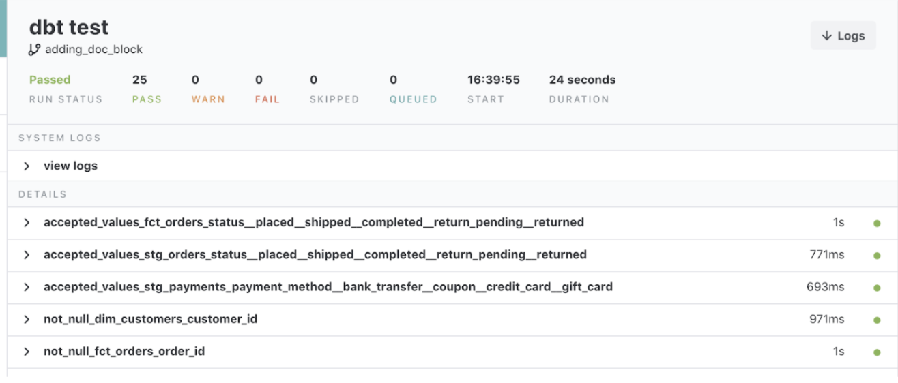
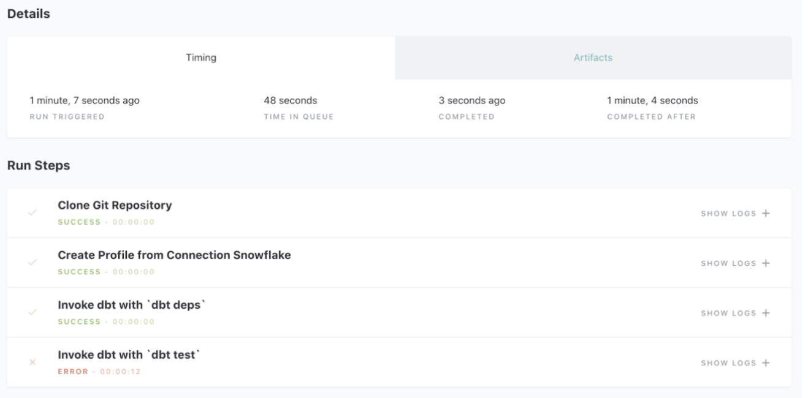

# Tests in dbt

### In dbt, there are two types of tests - generic tests and singular tests:
* **Generic tests** are written in YAML and return the number of records that do not meet your assertions. These are run on specific columns in a model.
* **Singular tests** are specific queries that you run against your models. These are run on the entire model.
* dbt ships with four built in tests: unique, not null, accepted values, relationships.
    * **Unique** tests to see if every value in a column is unique
    * **Not_null** tests to see if every value in a column is not null
    * **Accepted_values** tests to make sure every value in a column is equal to a value in a provided list
    * **Relationships tests** to ensure that every value in a column exists in a column in another model (see: referential integrity)
* Generic tests are configured in a YAML file, whereas singular tests are stored as select statements in the tests folder.
* Tests can be run against your current project using a range of commands:
    * ```dbt test``` runs all tests in the dbt project
    * ```dbt test --select test_type:generic```
    * ```dbt test --select test_type:singular```
    * ```dbt test --select one_specific_model```
* In development, dbt Cloud will provide a visual for your test results. Each test produces a log that you can view to investigate the test results further.


In production, dbt Cloud can be scheduled to run ```dbt test```. The ‘Run History’ tab provides a similar interface for viewing the test results.

